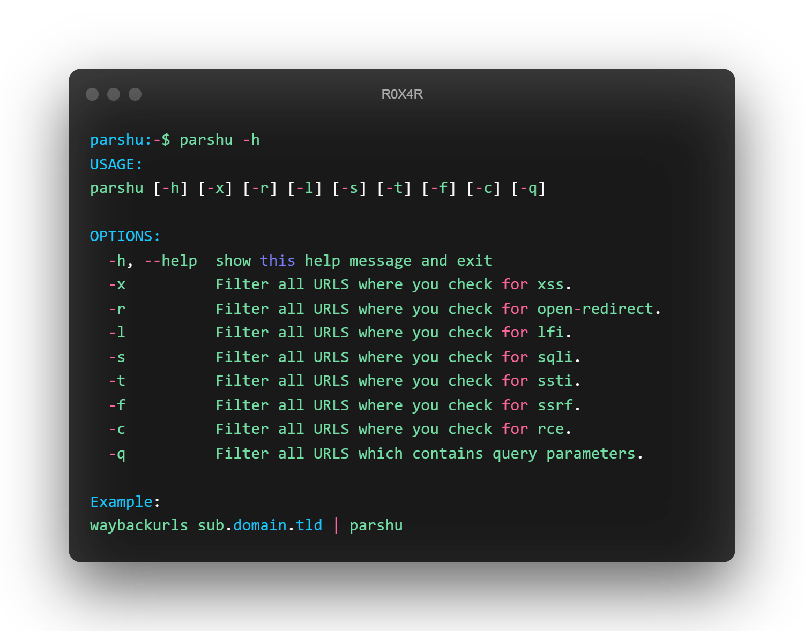
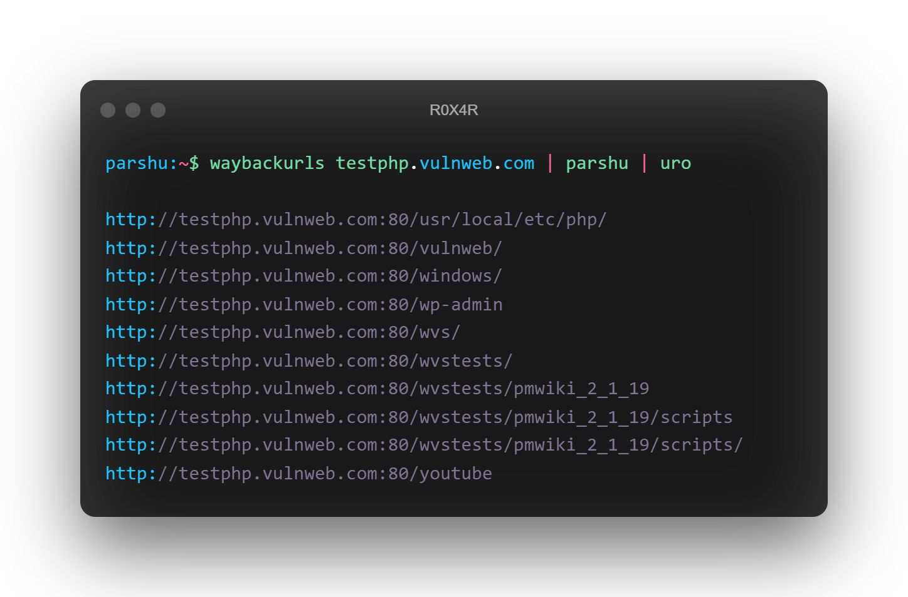

<h1 align="center">
  <br>
  <a href="https://github.com/R0X4R/Parshu"></a>
</h1>

<h4 align="center"><b>Filter URLs to save your time using regex</b></h4><br>

<p align="center">
  <a href="https://github.com/R0X4R/Parshu/releases">
    
  </a>
  <a href="#"></a>
<a href="https://twitter.com/R0X4R/"></a>
<a href="https://github.com/R0X4R/Garud/issues"></a>
<a href="https://github.com/R0X4R/Parshu/blob/main/LICENSE"></a>
<a href="https://github.com/R0X4R?tab=followers"></a>
  <a href="https://github.com/R0X4R/Parshu/issues?q=is%3Aissue+is%3Aclosed">
      
  </a>
  <a href="https://travis-ci.com/R0X4R/Parshu">
      
  </a>
</p>

<p align="center"></p>

---

**Parshu** uses regex to filter out the custom results. Remembering every regex or writing regexes for a task which you do daily is not easy, so **parshu** will help you to automate the task.

_Inspired from [tomnomnom's gf](https://github.com/tomnomnom/gf) tool_

### Features
- You can also add your custom regex to get results
- Filter out all the query parameters which you use to check vulnerabilities

### Installation


```console
$ pip3 install parshu
```

```console
$ wget -O parshu https://raw.githubusercontent.com/R0X4R/Parshu/main/parshu.py -q && chmod +x parshu && mv parshu /usr/bin/
```

### Usage

<p align="center"></p>

+ **For `linux`, `unix` and `debian` based systems**

    ```console
    $ waybackurls sub.domain.tld | parshu

    http://sub.domain.tld/wvstests/
    http://sub.domain.tld/wvstests/pmwiki_2_1_19
    http://sub.domain.tld/wvstests/pmwiki_2_1_19/scripts
    http://sub.domain.tld/wvstests/pmwiki_2_1_19/scripts/
    ```

+ **For `windows` based systems**

    ```console
    cmd> type urls.txt | python3 parshu.py
    ```

+ **If `no arguments` passed**

    ```console
    $ waybackurls sub.domain.tld | parshu

    http://sub.domain.tld/wvstests/
    http://sub.domain.tld/wvstests/pmwiki_2_1_19
    http://sub.domain.tld/wvstests/pmwiki_2_1_19/scripts
    http://sub.domain.tld/wvstests/pmwiki_2_1_19/scripts/
    ```

+ **To filter out the results for xss**

    > **Note**: To get parameters for other vulnerabilites use other arguments. To get all the arguments use `parshu -h`

    ```console
    $ waybackurls testphp.vulnweb.com | parshu -x

    http://testphp.vulnweb.com/artists.php?artist=1
    http://testphp.vulnweb.com/showimage.php?file=./pictures/1.jpg
    http://testphp.vulnweb.com/showimage.php?file=./pictures/1.jpg&size=160
    ```

### Donate
If this tool helped you or you like my work

</br><a href="https://www.buymeacoffee.com/R0X4R"></a> <a style=" width: 135px; background-color: #1065b7; text-align: center; font-weight: 800; padding: 11px 0px; color: white; font-size: 12px; display: inline-block; text-decoration: none; " href='https://pmny.in/bIKNZngt4ys1'> Donate Now </a> <a href="https://ko-fi.com/i/IK3K34SJSA"></a><br/><br/>